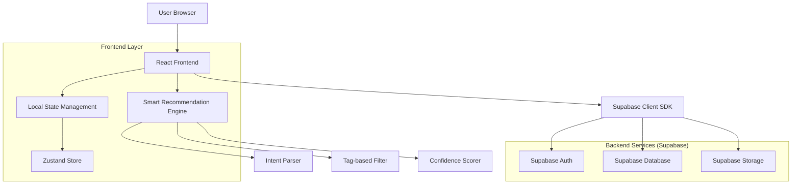
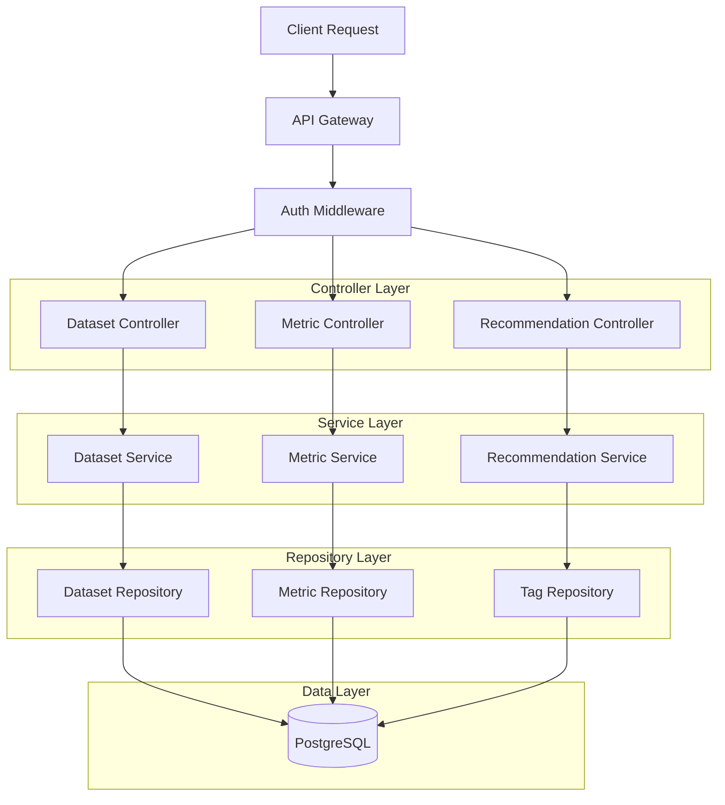
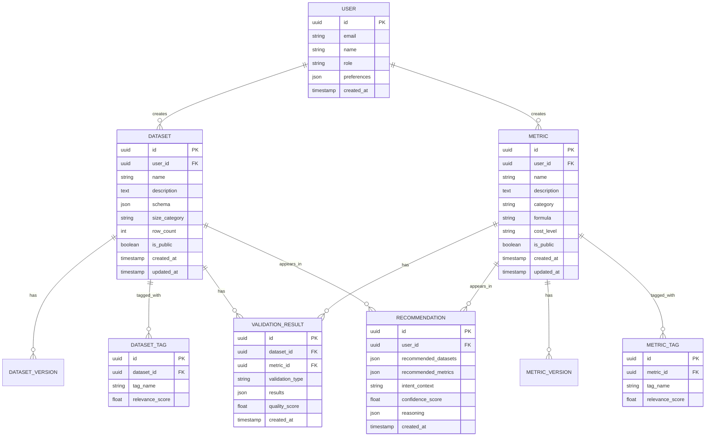

# Datasets and Metrics Management: Technical Architecture

## 1. Architecture Design



## 2. Technology Description

- **Frontend**: React@18 + TypeScript + Tailwind CSS@3 + Vite
- **Initialization Tool**: vite-init
- **Backend**: Supabase (PostgreSQL + Auth + Storage)
- **State Management**: Zustand for client-side state
- **UI Components**: shadcn/ui + Lucide React icons
- **Form Handling**: React Hook Form + Zod validation
- **Data Visualization**: Recharts for analytics charts
- **File Processing**: Papa Parse for CSV processing
- **Real-time**: Supabase Realtime for collaboration features

## 3. Route Definitions

| Route | Purpose |
|-------|---------|
| /datasets | Datasets dashboard with gallery view and search |
| /datasets/new | Dataset creation wizard with visual builder |
| /datasets/:id | Dataset detail view with editor and analytics |
| /datasets/:id/validate | Dataset validation studio |
| /metrics | Metrics dashboard with explorer view |
| /metrics/new | Metric builder with formula editor |
| /metrics/:id | Metric detail with documentation and testing |
| /recommendations | Smart recommendation center |
| /validation | Unified validation studio for datasets and metrics |

## 4. API Definitions

### 4.1 Dataset Management APIs

**Create Dataset**
```
POST /api/datasets
```

Request:
| Param Name | Param Type | isRequired | Description |
|------------|-------------|-------------|-------------|
| name | string | true | Dataset name |
| description | string | true | Dataset description |
| tags | string[] | false | Array of semantic tags |
| schema | object | true | Dataset schema definition |
| sample_data | object[] | false | Sample data rows |

Response:
| Param Name | Param Type | Description |
|------------|-------------|-------------|
| id | string | Unique dataset identifier |
| status | string | Creation status |
| validation_report | object | Validation results |

**Get Dataset Recommendations**
```
GET /api/datasets/recommendations?intent={intent}&context={context}
```

Request:
| Param Name | Param Type | isRequired | Description |
|------------|-------------|-------------|-------------|
| intent | string | true | User intent from conversation |
| context | object | false | Project context information |

Response:
| Param Name | Param Type | Description |
|------------|-------------|-------------|
| recommendations | array | Recommended datasets with scores |
| confidence | number | Overall confidence score |
| reasoning | string | Explanation of recommendations |

### 4.2 Metric Management APIs

**Create Custom Metric**
```
POST /api/metrics
```

Request:
| Param Name | Param Type | isRequired | Description |
|------------|-------------|-------------|-------------|
| name | string | true | Metric name |
| formula | string | true | Metric calculation formula |
| category | string | true | Metric category |
| description | string | true | Metric description |
| test_cases | object[] | false | Test cases for validation |

Response:
| Param Name | Param Type | Description |
|------------|-------------|-------------|
| id | string | Unique metric identifier |
| validation_status | string | Formula validation result |
| cost_estimate | string | Computational cost estimate |

**Test Metric**
```
POST /api/metrics/:id/test
```

Request:
| Param Name | Param Type | isRequired | Description |
|------------|-------------|-------------|-------------|
| sample_data | object[] | true | Test data rows |
| expected_results | number[] | false | Expected metric values |

Response:
| Param Name | Param Type | Description |
|------------|-------------|-------------|
| test_results | array | Calculated metric values |
| accuracy | number | Accuracy against expected results |
| performance | object | Execution time and resource usage |

## 5. Server Architecture Diagram



## 6. Data Model

### 6.1 Data Model Definition



### 6.2 Data Definition Language

**Users Table**
```sql
-- create table
CREATE TABLE users (
    id UUID PRIMARY KEY DEFAULT gen_random_uuid(),
    email VARCHAR(255) UNIQUE NOT NULL,
    name VARCHAR(100) NOT NULL,
    role VARCHAR(20) DEFAULT 'viewer' CHECK (role IN ('viewer', 'engineer', 'scientist', 'admin')),
    preferences JSONB DEFAULT '{}',
    created_at TIMESTAMP WITH TIME ZONE DEFAULT NOW(),
    updated_at TIMESTAMP WITH TIME ZONE DEFAULT NOW()
);

-- create index
CREATE INDEX idx_users_email ON users(email);
CREATE INDEX idx_users_role ON users(role);
```

**Datasets Table**
```sql
-- create table
CREATE TABLE datasets (
    id UUID PRIMARY KEY DEFAULT gen_random_uuid(),
    user_id UUID REFERENCES users(id) ON DELETE CASCADE,
    name VARCHAR(255) NOT NULL,
    description TEXT,
    schema JSONB NOT NULL,
    size_category VARCHAR(20) CHECK (size_category IN ('small', 'medium', 'large', 'xlarge')),
    row_count INTEGER DEFAULT 0,
    is_public BOOLEAN DEFAULT false,
    created_at TIMESTAMP WITH TIME ZONE DEFAULT NOW(),
    updated_at TIMESTAMP WITH TIME ZONE DEFAULT NOW()
);

-- create index
CREATE INDEX idx_datasets_user_id ON datasets(user_id);
CREATE INDEX idx_datasets_name ON datasets(name);
CREATE INDEX idx_datasets_public ON datasets(is_public);
CREATE INDEX idx_datasets_created_at ON datasets(created_at DESC);

-- RLS policies
ALTER TABLE datasets ENABLE ROW LEVEL SECURITY;

CREATE POLICY "Users can view public datasets" ON datasets
    FOR SELECT USING (is_public = true);

CREATE POLICY "Users can view their own datasets" ON datasets
    FOR SELECT USING (auth.uid() = user_id);

CREATE POLICY "Users can create their own datasets" ON datasets
    FOR INSERT WITH CHECK (auth.uid() = user_id);

CREATE POLICY "Users can update their own datasets" ON datasets
    FOR UPDATE USING (auth.uid() = user_id);
```

**Metrics Table**
```sql
-- create table
CREATE TABLE metrics (
    id UUID PRIMARY KEY DEFAULT gen_random_uuid(),
    user_id UUID REFERENCES users(id) ON DELETE CASCADE,
    name VARCHAR(255) NOT NULL,
    description TEXT,
    category VARCHAR(50) NOT NULL,
    formula TEXT NOT NULL,
    cost_level VARCHAR(20) CHECK (cost_level IN ('low', 'medium', 'high')),
    is_public BOOLEAN DEFAULT false,
    created_at TIMESTAMP WITH TIME ZONE DEFAULT NOW(),
    updated_at TIMESTAMP WITH TIME ZONE DEFAULT NOW()
);

-- create index
CREATE INDEX idx_metrics_user_id ON metrics(user_id);
CREATE INDEX idx_metrics_category ON metrics(category);
CREATE INDEX idx_metrics_public ON metrics(is_public);
CREATE INDEX idx_metrics_cost ON metrics(cost_level);

-- RLS policies
ALTER TABLE metrics ENABLE ROW LEVEL SECURITY;

CREATE POLICY "Users can view public metrics" ON metrics
    FOR SELECT USING (is_public = true);

CREATE POLICY "Users can view their own metrics" ON metrics
    FOR SELECT USING (auth.uid() = user_id);

CREATE POLICY "Users can create their own metrics" ON metrics
    FOR INSERT WITH CHECK (auth.uid() = user_id);
```

**Dataset Tags Table**
```sql
-- create table
CREATE TABLE dataset_tags (
    id UUID PRIMARY KEY DEFAULT gen_random_uuid(),
    dataset_id UUID REFERENCES datasets(id) ON DELETE CASCADE,
    tag_name VARCHAR(100) NOT NULL,
    relevance_score FLOAT DEFAULT 1.0,
    created_at TIMESTAMP WITH TIME ZONE DEFAULT NOW()
);

-- create index
CREATE INDEX idx_dataset_tags_dataset_id ON dataset_tags(dataset_id);
CREATE INDEX idx_dataset_tags_tag_name ON dataset_tags(tag_name);
CREATE INDEX idx_dataset_tags_relevance ON dataset_tags(relevance_score DESC);
```

**Recommendations Table**
```sql
-- create table
CREATE TABLE recommendations (
    id UUID PRIMARY KEY DEFAULT gen_random_uuid(),
    user_id UUID REFERENCES users(id) ON DELETE CASCADE,
    recommended_datasets JSONB NOT NULL,
    recommended_metrics JSONB NOT NULL,
    intent_context TEXT,
    confidence_score FLOAT NOT NULL,
    reasoning JSONB,
    created_at TIMESTAMP WITH TIME ZONE DEFAULT NOW()
);

-- create index
CREATE INDEX idx_recommendations_user_id ON recommendations(user_id);
CREATE INDEX idx_recommendations_confidence ON recommendations(confidence_score DESC);
CREATE INDEX idx_recommendations_created_at ON recommendations(created_at DESC);
```

## 7. Smart Recommendation Engine Implementation

### Intent Parser Service
```typescript
interface IntentParser {
  extractIntent(userInput: string, context: UserContext): ParsedIntent;
  categorizeIntent(intent: ParsedIntent): IntentCategory;
  extractKeywords(text: string): string[];
}

class TagBasedIntentParser implements IntentParser {
  private keywordMap: Map<string, string>;
  private contextAnalyzer: ContextAnalyzer;
  
  extractIntent(userInput: string, context: UserContext): ParsedIntent {
    const keywords = this.extractKeywords(userInput);
    const category = this.categorizeIntent({ keywords, context });
    const confidence = this.calculateConfidence(keywords, category);
    
    return {
      primaryIntent: category.primary,
      secondaryIntents: category.secondary,
      keywords,
      confidence,
      context
    };
  }
}
```

### Recommendation Algorithm
```typescript
interface RecommendationEngine {
  generateRecommendations(intent: ParsedIntent, userContext: UserContext): Recommendation[];
  calculateRelevanceScore(item: Dataset | Metric, intent: ParsedIntent): number;
  optimizeRecommendations(recommendations: Recommendation[]): Recommendation[];
}

class TagBasedRecommendationEngine implements RecommendationEngine {
  generateRecommendations(intent: ParsedIntent, userContext: UserContext): Recommendation[] {
    const datasets = this.filterDatasetsByIntent(intent);
    const metrics = this.filterMetricsByIntent(intent);
    
    return this.combineRecommendations(datasets, metrics, intent);
  }
  
  private filterDatasetsByIntent(intent: ParsedIntent): Dataset[] {
    return datasets.filter(dataset => {
      const tagMatches = dataset.tags.some(tag => 
        intent.keywords.includes(tag.toLowerCase())
      );
      const categoryMatch = this.matchCategory(dataset, intent.primaryIntent);
      
      return tagMatches || categoryMatch;
    });
  }
}
```

## 8. File Upload and Processing

### Dataset Upload Handler
```typescript
interface FileUploadProcessor {
  processFile(file: File): Promise<ProcessedDataset>;
  validateSchema(data: any[]): ValidationResult;
  generatePreview(data: any[], limit: number): DatasetPreview;
}

class CSVFileProcessor implements FileUploadProcessor {
  async processFile(file: File): Promise<ProcessedDataset> {
    const text = await file.text();
    const parsed = Papa.parse(text, { header: true });
    
    const schema = this.inferSchema(parsed.data);
    const validation = this.validateSchema(parsed.data);
    const preview = this.generatePreview(parsed.data, 10);
    
    return {
      name: file.name,
      schema,
      data: parsed.data,
      validation,
      preview,
      rowCount: parsed.data.length
    };
  }
  
  private inferSchema(data: any[]): DatasetSchema {
    const columns = Object.keys(data[0]);
    return columns.map(column => ({
      name: column,
      type: this.inferColumnType(data, column),
      nullable: this.checkNullable(data, column)
    }));
  }
}
```

## 9. Real-time Collaboration

### Collaboration Service
```typescript
interface CollaborationService {
  subscribeToDataset(datasetId: string, callback: CollaborationCallback): void;
  broadcastChange(change: CollaborationChange): void;
  resolveConflict(local: any, remote: any): any;
}

class SupabaseCollaborationService implements CollaborationService {
  private realtime: SupabaseRealtimeClient;
  
  subscribeToDataset(datasetId: string, callback: CollaborationCallback): void {
    this.realtime
      .channel(`dataset:${datasetId}`)
      .on('broadcast', { event: 'change' }, (payload) => {
        callback(payload.change);
      })
      .subscribe();
  }
  
  broadcastChange(change: CollaborationChange): void {
    this.realtime.channel(`dataset:${change.datasetId}`).send({
      type: 'broadcast',
      event: 'change',
      payload: { change }
    });
  }
}
```

## 10. Performance Optimization

### Caching Strategy
```typescript
interface CacheManager {
  get<T>(key: string): Promise<T | null>;
  set<T>(key: string, value: T, ttl?: number): Promise<void>;
  invalidate(pattern: string): Promise<void>;
}

class DatasetCacheManager implements CacheManager {
  private cache = new Map<string, CacheEntry>();
  
  async get<T>(key: string): Promise<T | null> {
    const entry = this.cache.get(key);
    if (!entry) return null;
    
    if (Date.now() > entry.expiresAt) {
      this.cache.delete(key);
      return null;
    }
    
    return entry.value as T;
  }
  
  async set<T>(key: string, value: T, ttl = 300000): Promise<void> {
    this.cache.set(key, {
      value,
      expiresAt: Date.now() + ttl
    });
  }
}
```

This technical architecture provides a robust foundation for implementing the Datasets and Metrics management modules with seamless integration into the existing smart recommendation system while maintaining high performance and user experience standards.