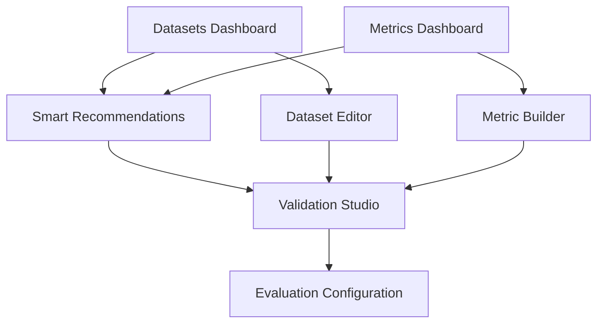

# Datasets and Metrics Management Modules PRD

## 1. Product Overview

This document defines the Datasets and Metrics management modules for the AI-Assisted Evaluation Configuration System. These modules provide users with intuitive tools to create, organize, and manage evaluation datasets and metrics while leveraging the smart recommendation system for intelligent suggestions.

The modules solve the critical problem of evaluation data management complexity by providing visual, conversational interfaces that make it easy to create, understand, and maintain evaluation configurations without requiring deep technical expertise.

## 2. Core Features

### 2.1 User Roles

| Role | Registration Method | Core Permissions |
|------|---------------------|------------------|
| Evaluation Engineer | Email registration | Create/edit datasets and metrics, view all public datasets |
| Data Scientist | Invitation upgrade | Advanced metric creation, dataset validation, export capabilities |
| Team Admin | Admin assignment | Manage team datasets, set permissions, configure smart recommendations |
| Viewer | Email registration | View and use public datasets/metrics, cannot create/edit |

### 2.2 Feature Module

Our datasets and metrics management system consists of the following main pages:

1. **Datasets Dashboard**: Overview of all datasets with search, filtering, and quick actions
2. **Dataset Editor**: Visual interface for creating and editing datasets with smart field suggestions
3. **Metrics Dashboard**: Centralized view of all metrics with categorization and usage analytics
4. **Metric Builder**: Interactive tool for creating custom metrics with formula validation
5. **Smart Recommendations Panel**: AI-powered suggestions for dataset-metric combinations
6. **Validation Studio**: Test datasets and metrics with sample data before deployment

### 2.3 Page Details

| Page Name | Module Name | Feature description |
|-----------|-------------|---------------------|
| Datasets Dashboard | Dataset Gallery | Browse all datasets with thumbnail previews, tag-based filtering, and usage statistics. Search by name, tags, or description with instant results. |
| Datasets Dashboard | Quick Actions | One-click actions: Duplicate, Export, Share, Archive. Bulk operations for multiple datasets. |
| Datasets Dashboard | Smart Suggestions | AI recommends datasets based on recent activity and project context. Shows "Why this recommendation?" with confidence scores. |
| Dataset Editor | Visual Builder | Drag-and-drop interface for dataset creation. Smart field detection from uploaded files. Auto-generates descriptions and tags. |
| Dataset Editor | Data Preview | Live preview of dataset structure with sample rows. Validation warnings for common issues (missing values, format errors). |
| Dataset Editor | Collaboration Tools | Real-time collaboration indicators, comments system, version history with diff view. |
| Metrics Dashboard | Metric Explorer | Grid and list views with advanced filtering by category, cost, complexity. Usage analytics showing adoption trends. |
| Metrics Dashboard | Category Management | Organize metrics into custom categories. Bulk category assignment and smart categorization suggestions. |
| Metrics Dashboard | Performance Insights | Shows computational cost, accuracy trends, and user ratings for each metric. |
| Metric Builder | Formula Editor | Visual formula builder with drag-and-drop components. Real-time syntax validation and error highlighting. |
| Metric Builder | Test Environment | Immediate testing with sample data. Compare results across different datasets. Benchmark against standard metrics. |
| Metric Builder | Documentation Generator | Auto-generates metric documentation with examples, use cases, and implementation notes. |
| Smart Recommendations | Context Analyzer | Analyzes project requirements and suggests optimal dataset-metric combinations. Explains reasoning in plain language. |
| Smart Recommendations | Cost Optimizer | Balances evaluation thoroughness with computational budget. Provides cost-benefit analysis for different configurations. |
| Validation Studio | Sample Testing | Test datasets and metrics with configurable sample sizes. Generate detailed validation reports. |
| Validation Studio | Quality Scoring | Assigns quality scores to datasets and reliability scores to metrics based on validation results. |

## 3. Core Process

### Dataset Management Flow
Users start by browsing existing datasets on the Datasets Dashboard. The smart recommendation system analyzes their project context and suggests relevant datasets. Users can either select existing datasets or create new ones using the visual Dataset Editor, which provides intelligent field mapping and automatic tag generation. Throughout the process, AI assists with validation, documentation, and optimization suggestions.

### Metric Management Flow
The system guides users through metric selection based on their evaluation goals. The Metrics Dashboard provides comprehensive analytics on metric usage and performance. Users can create custom metrics using the visual Metric Builder, which includes real-time testing and validation. The smart recommendation engine suggests metric combinations that work well together and align with the selected datasets.

### Smart Recommendation Integration
The recommendation system continuously analyzes user behavior, project context, and industry best practices to provide increasingly accurate suggestions. It explains its reasoning in accessible language and allows users to refine recommendations through natural conversation.



## 4. User Interface Design

### 4.1 Design Style
- **Primary Colors**: Deep indigo (#4F46E5) for primary actions, emerald (#10B981) for success states
- **Secondary Colors**: Cool gray palette for backgrounds, violet accents for highlights
- **Button Style**: Rounded corners (8px radius) with subtle shadows, gradient hover effects
- **Typography**: Inter font family with clear hierarchy - 14px body, 16px labels, 20px headers
- **Layout Style**: Card-based design with generous whitespace, glassmorphism effects for modals
- **Icons**: Lucide React icons with consistent 1.5px stroke width

### 4.2 Page Design Overview

| Page Name | Module Name | UI Elements |
|-----------|-------------|-------------|
| Datasets Dashboard | Dataset Gallery | Masonry grid layout with dataset cards showing preview thumbnails, usage badges, and smart recommendation ribbons. Sticky search bar with advanced filter panel. |
| Dataset Editor | Visual Builder | Split-pane interface with file upload zone on left, field mapping canvas in center, and properties panel on right. Real-time validation indicators. |
| Metrics Dashboard | Metric Explorer | Sortable table with sparkline charts showing usage trends. Category pills with color coding. Quick action dropdown menus. |
| Metric Builder | Formula Editor | Visual node-based editor with drag-and-drop components. Syntax highlighting with error underlining. Live preview panel showing calculation results. |
| Smart Recommendations | Context Analyzer | Conversational interface with message bubbles explaining recommendations. Confidence scores displayed as progress bars. Quick accept/modify buttons. |

### 4.3 Responsiveness
Desktop-first design approach with responsive breakpoints at 1280px, 1024px, 768px, and 640px. Touch interaction optimization for tablet use with larger tap targets and swipe gestures for mobile navigation.

### 4.4 Accessibility Features
- WCAG 2.1 AA compliance with proper color contrast ratios
- Keyboard navigation support for all interactive elements
- Screen reader optimization with proper ARIA labels
- High contrast mode support for users with visual impairments

## 5. Smart Recommendation System Integration

### Intent Recognition Enhancement
The system extends the existing keyword-based approach with contextual analysis:

```typescript
// Enhanced intent extraction with context
const extractIntent = (userInput: string, projectContext: any) => {
  const baseIntent = extractBaseIntent(userInput);
  const contextualModifiers = analyzeContext(projectContext);
  return combineIntentWithContext(baseIntent, contextualModifiers);
};
```

### Recommendation Confidence Scoring
Each recommendation includes detailed confidence scoring based on:
- **Tag Match Strength**: How well dataset/metric tags align with user intent
- **Historical Success**: Previous effectiveness of similar combinations
- **Domain Compatibility**: Technical compatibility between components
- **Cost Efficiency**: Balance between thoroughness and computational cost

### Adaptive Learning
The system learns from user interactions:
- Tracks which recommendations users accept or modify
- Adjusts confidence scores based on feedback
- Identifies emerging patterns in user preferences
- Updates recommendation algorithms based on successful configurations

## 6. Implementation Considerations

### Performance Optimization
- Virtual scrolling for large dataset lists
- Lazy loading for dataset previews
- Debounced search with 300ms delay
- Client-side caching for frequently accessed data

### Data Validation
- Real-time schema validation for uploaded datasets
- Automatic data type detection and correction suggestions
- Duplicate detection across dataset collections
- Quality scoring based on completeness and consistency

### Collaboration Features
- Real-time presence indicators showing who's editing
- Comment threads on specific dataset/metric elements
- Version control with rollback capabilities
- Permission-based access control for team environments